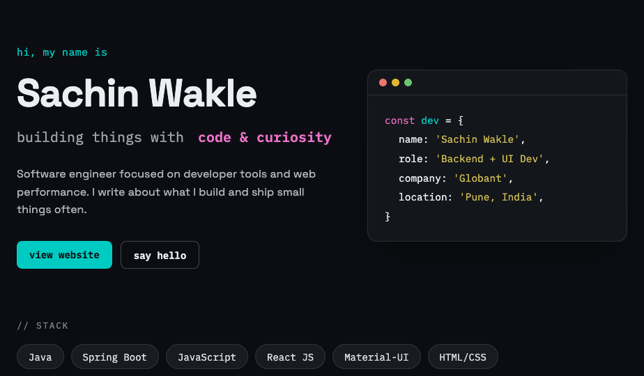

<!-- ### Hi there 👋 -->

- 🔭 I’m currently working on hotel management project based on react-js, material-ui
-  :writing_hand: Writing on <a target="_blank" href="https://medium.com/tech-journo"></img></a>

## Stack

## Connect with me
<a target="_blank" href="https://www.linkedin.com/in/sbwakle"></img></a>
<a target="_blank" href="mailto:sachinwakle2002@gmail.com"></img></a>
<a target="_blank" href="https://twitter.com/sachinwakle01"></img></a>

## Github Stats
### 

