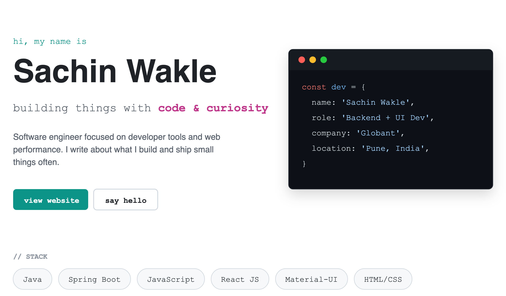

# Hey, I'm Sachin 👋
### Full-stack developer · 10 years in · now building my own products

## 🧭 About me

A decade in, still building by hand.

Ten years as a full-stack developer, most of it inside stable full-time roles — the kind of work that teaches you what actually breaks in production.

For the last stretch, evenings have gone into something different: shipping products of my own, end to end, without a team or a deadline handed down from someone else.

No solo product had gone all the way from idea to real users before **[ReplyLikePro](https://github.com/sachinwakle/replylikepro)**. Everything since has been about doing that again, deliberately — and eventually turning it into independence rather than a side hobby.

## 🚀 Featured projects

| | |
|---|---|
| **[ReplyLikePro](https://github.com/sachinwakle/replylikepro)** | The first solo product I've taken all the way from idea to real users |
| **[TidyTube](https://github.com/sachinwakle/TidyTube)** | Chrome extension that strips distracting YouTube content — live on the Web Store |
| **[WhatsApp Redirect](https://github.com/sachinwakle/whatsapp-redirect)** | Open a WhatsApp chat with any number, no contact save required |
| **[IPL Dashboard](https://github.com/sachinwakle/ipl-dashboard)** | Live dashboard for IPL match & stats data |
| **[sachinwakle.github.io](https://github.com/sachinwakle/sachinwakle.github.io)** | Professional profile & portfolio site |

## 🛠️ Tech stack

## 📚 Right now

- 🔭 Growing **ReplyLikePro** from "shipped" to sustainable
- 🌱 Building the next solo product, and the one after that — deliberately, not as a side hobby
- ✍️ Writing on 

## 📊 GitHub stats

## 🤝 Connect with me

